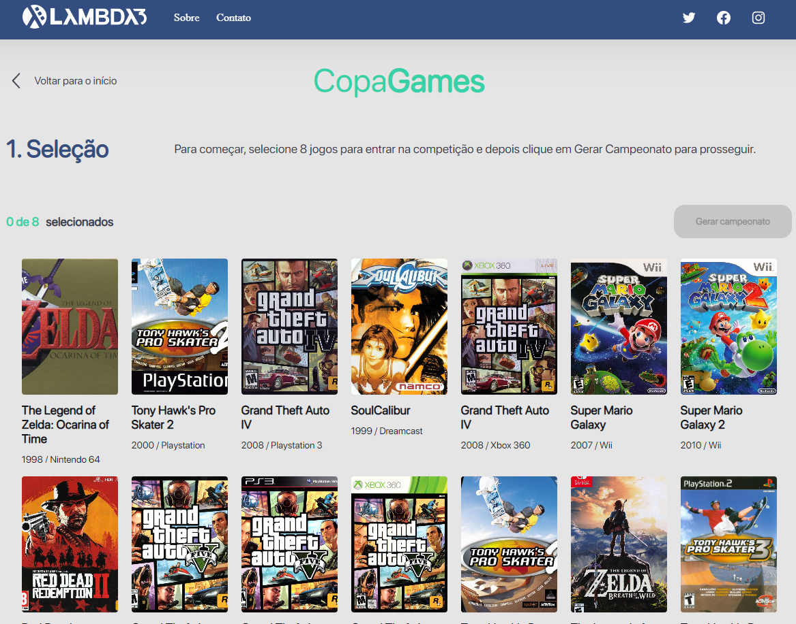

# Copa Games

## Ao receber a proposta da avaliação técnica, desenvolvi uma aplicação WEB de geração de partidas onde o usuário poderá selecionar 8 participantes. Após a seleção dos participantes, o sistema irá fazer o pareamento das partidas sendo que com a maior nota vence. Caso haja um empate entre as notas, o vencedor será aquele com o ano de lançamento mais recente. Se ainda assim o empate persistir, o vencedor será o primeiro na ordem alfabética.

- Link do projeto: <a href="https://copagame.herokuapp.com/" target="_blank">https://copagame.herokuapp.com/</a>

## Tecnologias

Tecnologias e ferramentas utilizadas no desenvolvimento do projeto:

- [React](https://reactjs.org/)
- [Redux](https://redux-toolkit.js.org/)
- [Axios](https://axios-http.com/)
- [Material-UI](https://mui.com/material-ui/getting-started/overview/)
- [SASS](https://sass-lang.com/)
- [VS Code](https://code.visualstudio.com/) com [ESLint](https://eslint.org/)

 
